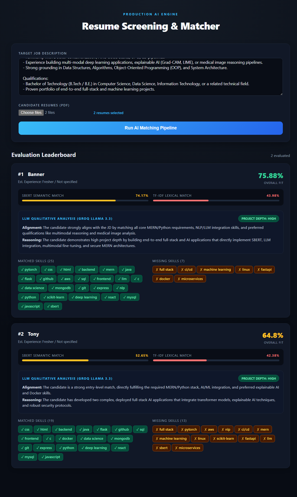

# ScreenGrid: High-Throughput AI Resume Screening & Semantic Ranking Engine

ScreenGrid is an automated candidate evaluation and ranking system designed to parse, match, and evaluate resumes against target Job Descriptions (JDs) with low latency. It combines semantic vector embeddings, entity-based skill extraction, and asynchronous LLM orchestration to generate calibrated multi-dimensional candidate fit scores.

---

## 📸 Screenshot



---

## 🔬 System Architecture

```
               [ Bulk Candidate Resumes (PDF / DOCX) ] & [ Target Job Description ]
                                                  │
                                                  ▼
                                   ┌──────────────────────────────┐
                                   │  Document Parsing Pipeline   │
                                   │  - PyPDF / python-docx       │
                                   │  - Text Normalization        │
                                   └──────────────┬───────────────┘
                                                  │
                         ┌────────────────────────┴────────────────────────┐
                         ▼                                                 ▼
          ┌──────────────────────────────┐                  ┌──────────────────────────────┐
          │   Dense Semantic Encoding    │                  │  Named Entity & Skill Parser │
          │  - SBERT (MiniLM-L6-v2)      │                  │  - spaCy Entity Extraction   │
          │  - Contextual Embeddings     │                  │  - Technical Taxonomy Match  │
          └──────────────┬───────────────┘                  └──────────────┬───────────────┘
                         │                                                 │
                         └────────────────────────┬────────────────────────┘
                                                  │
                                                  ▼
                                   ┌──────────────────────────────┐
                                   │   Cosine Similarity Matrix   │
                                   │   - Vector Distance Scoring  │
                                   │   - Hard Skill Overlap Ratio │
                                   └──────────────┬───────────────┘
                                                  │ Top-K Filtered Candidates
                                                  ▼
                                   ┌──────────────────────────────┐
                                   │ Asynchronous LLM Evaluator   │
                                   │ - Groq (Llama-3 / Mixtral)   │
                                   │ - Concurrent Thread Pool     │
                                   │ - Multi-Criteria Rubric      │
                                   └──────────────┬───────────────┘
                                                  │
                                                  ▼
                                   [ Ranked Candidate Leaderboard ]
                                   - Overall Fit Score (0 - 100%)
                                   - Semantic Alignment Metric
                                   - Strengths, Weaknesses & Red Flags
                                   - Role-Fit Justification
```

---

## 🧠 Core Evaluation Rubric

ScreenGrid scores candidate applications through a three-tier hybrid evaluation pipeline:

| Tier                                  | Evaluation Method                          | Weight | Purpose                                                                             |
| ------------------------------------- | ------------------------------------------ | ------ | ----------------------------------------------------------------------------------- |
| **Tier 1: Semantic Embeddings**       | Sentence-Transformers (`all-MiniLM-L6-v2`) | 40%    | Measures deep semantic alignment between candidate experience and role domain.      |
| **Tier 2: Entity & Skill Overlap**    | Custom spaCy Entity Matcher & Set Overlap  | 30%    | Enforces mandatory hard skill, tool, and framework requirements.                    |
| **Tier 3: Structured LLM Assessment** | Fast Groq Inference Pipeline               | 30%    | Analyzes years of experience, leadership scope, and project relevance without bias. |

---

---

## 🛠 Tech Stack

| Category            | Tools                                                              |
| ------------------- | ------------------------------------------------------------------ |
| API & Serving       | Python, FastAPI, Uvicorn, Pydantic                                 |
| NLP & Embeddings    | spaCy, Hugging Face `sentence-transformers`, PyTorch, Scikit-Learn |
| LLM Engine          | Groq SDK (Llama 3 / Mixtral inference acceleration)                |
| Document Processing | PyPDF, python-docx                                                 |
| Frontend            | React.js, Tailwind CSS                                             |

---

## 🚀 Local Setup & Reproduction

### Prerequisites

- Python 3.10+
- Node.js 18+ (for frontend dashboard)
- Groq Cloud API Key

### 1. Clone Repository

```bash
git clone https://github.com/charannamani/ScreenGrid.git
cd ScreenGrid
```

### 2. Backend Environment Setup

```bash
# Create and activate virtual environment
python -m venv venv
source venv/bin/activate  # On Windows: venv\Scripts\activate

# Install dependencies
pip install -r requirements.txt

# Download spaCy NLP model
python -m spacy download en_core_web_sm
```

### 3. Configure Environment Variables

Create a `.env` file in the root directory and add your credentials:

```
GROQ_API_KEY=your_groq_api_key_here
PORT=8000
```

### 4. Run the Engine

```bash
# Start FastAPI backend server
uvicorn src.app:app --reload --port 8000
```

Navigate to `http://localhost:8000/docs` to interact with the Swagger API testing suite.

### 5. Run the Frontend

```bash
cd client
npm install
npm run dev
```
