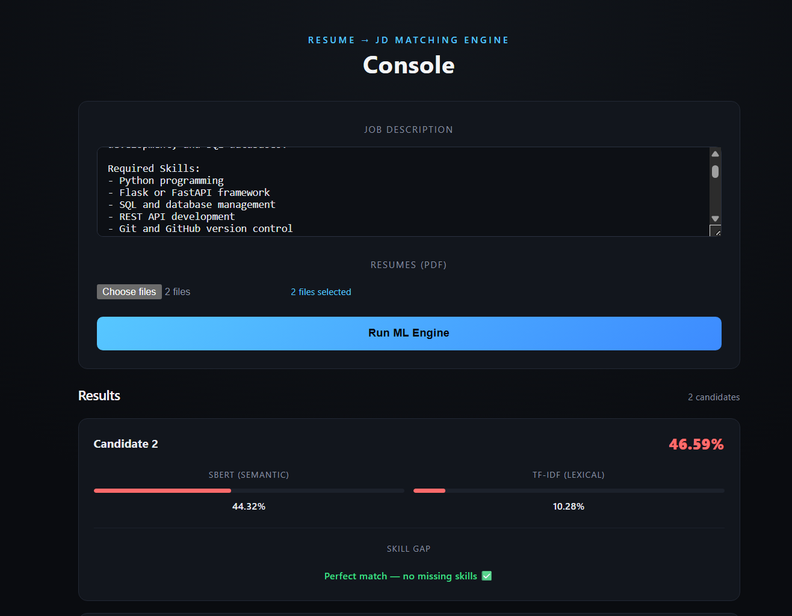

# AI Powered Resume Screening and Candidate Ranking System

An intelligent resume screening system that analyzes candidate resumes against job descriptions using NLP, semantic similarity models, and LLM-based reasoning.

## Features

- Upload multiple PDF resumes
- Extract text from PDF documents
- NLP preprocessing using spaCy
- TF-IDF similarity scoring
- SBERT semantic similarity matching
- Skill gap detection
- LLM-based candidate reasoning using Groq API
- Candidate ranking based on combined score
- React frontend + Flask backend integration

## Tech Stack

Frontend:

- React.js
- Axios

Backend:

- Flask
- Flask-CORS
- SQLite

Machine Learning / NLP:

- spaCy
- TF-IDF Vectorization
- Sentence Transformers (all-MiniLM-L6-v2)
- Cosine Similarity

LLM Layer:

- Groq API (Llama 3.3 70B)

Document Processing:

- pdfplumber

## System Workflow

PDF Resume Upload
→ Text Extraction
→ NLP Cleaning
→ Skill Extraction
→ TF-IDF Matching
→ SBERT Semantic Analysis
→ LLM Candidate Evaluation
→ Skill Gap Detection
→ Final Candidate Ranking

## Sample Output

Candidate 1

- TF-IDF Score: 81%
- SBERT Score: 88%
- Combined Score: 85%
- Missing Skills: Docker, AWS

Candidate 2

- TF-IDF Score: 62%
- SBERT Score: 70%
- Combined Score: 66%

## Future Improvements

- BERT fine-tuned ranking model
- Support DOCX resumes
- Recruiter dashboard
- Batch candidate analytics

## Run Locally

Backend

pip install -r requirements.txt
python src/app.py

Frontend

cd client
npm install
npm run dev

## Demo

